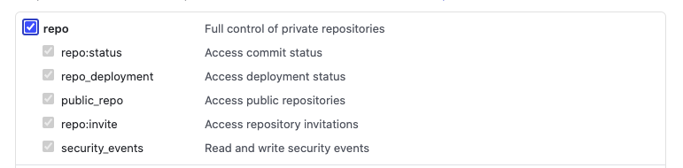
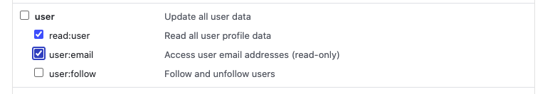

# The Endpoint Package

The Endpoint package handles installing mapping templates, ILM policies, ingest pipelines, and other functionality
that should be done prior to the Endpoint streaming data to ES and using the Endpoint app in Kibana.

The Endpoint package is located [locally here](./package/endpoint) and [remotely here](https://github.com/elastic/package-storage/tree/production/packages/endpoint)

To update the endpoint package clone this repo and make changes as needed

## Tool Prerequisites

This section includes a list of tools that should be installed before making changes to the Endpoint's mapping.
The individual sections below will give more details about how each tool is used and setup.

- Install go 1.14 from here: <https://golang.org/dl/>

- Install [Python 3.6+](https://www.python.org/)

- Install [hub](https://github.com/github/hub) tool:
  - mac: `brew install hub`
  - debian-based: `sudo apt install hub`

NOTE: If you are using a higher version than python3 the make command may fail. You'll have to edit the Makefile and replace `3.7` with your python version.

## Updating the Endpoint Package Mapping

To update the endpoint package mapping take a look at the [Custom Schema](./custom_schemas/README.md) and
[Custom Subset](./custom_subsets/README.md) first to get an understanding of what makes up the mapping.

The essential steps are listed here:

- Edit/add custom schema files as needed to define any fields that don't exist in ECS core

- Update the subset files for the particular event that is being changed or create a new subset file

- If a new type of document is being added that doesn't fit in the existing ones (e.g. events),
  create a new directory in `custom_subsets/elastic_endpoint` to contain the subset files

- Generate the mapping

### Generating the mapping

Run `make` (to speed things up try running `make -j8`)

The files will be built into the directory `out`, with the important reference files copied to `generated`, and `schemas`, and the final package file in `package/endpoint/data_stream/*/fields/fields.yml`

If you believe `make` is not picking up your changes, you can force a rebuilt with the `-B` option:

```sh
make -B -j12
```

### Note about the ECS Version

The generated files are dependent on the github version of ECS used. To use a more recent version
of ECS to pick up new definition chance the `ECS_GIT_REF` in the **Makefile**. You can also
make a temporary change command line `make ECS_GIT_REF=v1.6.0`. But be sure to commit this to the
**Makefile** when you are done and satisfied with your change.

### Testing Changes

Once you've generated the new mappings, you'll want to test the changes. To test changes to the Endpoint package you will need to point your Kibana at a locally running package registry.
More details about the package registry are [here](https://github.com/elastic/package-registry/blob/master/README.md#running)

Use the `make run-registry` command to quickly run a package registry locally once you have go installed.

Add the follow flags to your `kibana.dev.yaml` file

```yaml
xpack.fleet.enabled: true
xpack.fleet.registryUrl: "http://127.0.0.1:8080"
xpack.fleet.fleet.enabled: true
```

The `xpack.fleet.registryUrl` flag instructs Kibana to look for the package registry at the specified URL.
By default Kibana uses the external package registry.

The Ingest Manager will now use your locally running package registry for retrieving a package. The Ingest Manager
within Kibana does some caching after it has downloaded a package, so if you are not seeing your changes you might
need to restart Kibana and Elasticsearch.

If you want to check you are using the correct Ingest manager go to Management -> Integrations in Kibana and search for Endpoint Security. Observe the version number. You should see the `-dev` sufix in the version.

If you don't see your version in the Integration you want to make sure the Ingest Manager is running correctly you can try a request to test it:

```bash
curl "http://localhost:8080/search?package=endpoint"
```

If you see a JSON response, the Ingest Manager is running and it is probably a problem in your Kibana configuration. If you don't get a response you should check the running Ingest Manager process you probably started with docker.

### PR the changes

After making and testing the necessary changes, PR them to this repo.

## Updating the package in the remote registry

There are three environments that provide different functionality for packages: snapshot, staging, and production.

Snapshot is used for testing packages. It is mainly used by running kibana from source off the `master` branch. The endpoint package's
release manager script releases to `snapshot`.

Staging is for packages that need a little more testing but are almost ready for production.

Production is used by official deployments of the elastic stack.

To release a new endpoint package a PR will be opened against the package-storage repo <https://github.com/elastic/package-storage> with
the contents of the new endpoint package. A new version number directory should be created here: <https://github.com/elastic/package-storage/tree/snapshot/packages/endpoint> with the appropriate version number for this release. Once this PR is merged a docker image will be built containing
the new endpoint package. There is still a manual step of pushing the docker image to the snapshot environment.

### Release Manager

To release the endpoint package to snapshot run `make release`. This will run the release_manager script. The release manager
script will ask if this release is a `dev` or `prod` release. A `dev` release is an interim package that is never meant to
be released to production. The version for these packages will have `-dev.#` to indicate that it is a dev package. A `prod`
release is a little different in that it will remove the `-dev.#` portion of the version so the string is `#.#.#` and tag the release in the
endpoint-package repo.

After choosing the type of release, the script will prompt for the remote branch in the endpoint-package repo that should be released. Most release will
probably come from the `master` branch because this is where the latest package code is developed. If a bugfix is needed for an already released package,
then we'll need to use a release branch (e.g. 7.9). Once the remote branch is chosen a draft PR will be opened to the `snapshot` branch for the package-storage repo.
If this is a `prod` release and the branch used was `master`, the script will prompt for which version part (`major`, `minor`, or `patch`) should be increased for the next
future release. If the branch was not `master` then the script only increments the `patch` part of the version because it
assumes a release branch was being used (e.g. 7.9, 7.10, etc).

### Creating new docker images

Once the PR is merged to the `snapshot` branch CI will kick off a new build for that branch that will release a new docker image.
The images can be located here: <https://container-library.elastic.co/r/package-registry/distribution>

If for some reason the `snapshot` branch CI does kick off a new build, you can manually trigger it here: <https://beats-ci.elastic.co/blue/organizations/jenkins/Beats%2Fpackage-storage/branches>

### Deploying a new registry with the package

Make sure the docker image for the environment you want to deploy to was rebuilt and finished as above. Once complete, you can deploy it with this CI release job:

<https://beats-ci.elastic.co/job/Ingest-manager/job/release-distribution/build?delay=0sec>

### Promoting a package to a new environment

Once all the issues have been worked out while testing in `snapshot` and `staging` the package is ready to be released in production.

To promote a package from one environment to another, we'll use the `elastic-package` tool from <https://github.com/elastic/elastic-package>. To setup
the tool follow the instructions in its github repo. The short list is:

- `go get github.com/elastic/elastic-package`

- Create a github api token with `repo`, `read:user`, and `user:email` boxes checked





- Place the token string in this file: `~/.elastic/github.token`

- Make sure `elastic-package` is in your `$PATH`

NOTE: The `elastic-package` tool is included in this repo under `scripts/go-tools`. It is built after running make. It is pinned to a specific version
and might be old. It is recommended to use `go get ...` to retrieve the latest tool.

Run `elastic-package promote` or run `make promote`. The tool will present a number of prompts to find the package to promote to the next environment.
Once the tool is finished, new PRs should be created moving the desired package from one environment to the next. Make sure to merge PR that
moves the package to the next environment before merging the PR that deletes the package from the original environment.

After the PRs are merged go through the steps to deploy the new docker images for that environment.
